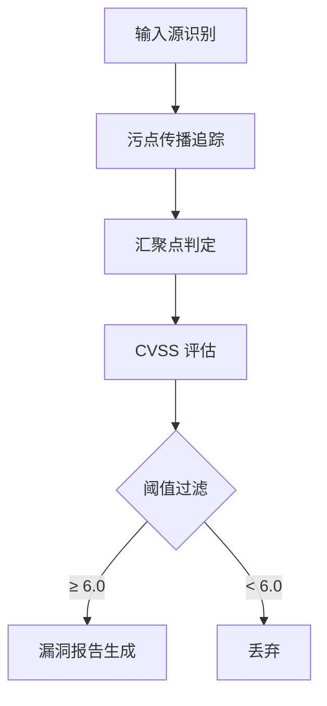

# PHP 代码审计系统技术设计文档

需求名称：php-code-audit
更新日期：2026-03-29

## 1. 概述

本系统是一个基于深度污点分析的 PHP 代码自动化审计工具，通过静态分析技术追踪用户输入的传播路径，识别高危漏洞（CVSS ≥ 6.0）。

## 2. 架构设计



### 2.1 核心模块

| 模块 | 职责 |
|-----|------|
| Lexer | PHP 词法分析，生成 Token 流 |
| Parser | PHP 语法分析，生成 AST |
| TaintAnalyzer | 污点传播追踪引擎 |
| SinkDetector | 危险函数汇聚点检测 |
| FilterAnalyzer | 安全过滤识别与绕过检测 |
| CVSSCalculator | CVSS 评分计算 |
| ReportGenerator | 漏洞报告输出 |

## 3. 组件与接口

### 3.1 TaintAnalyzer

```typescript
interface TaintAnalyzer {
    // 添加污点源
    addTaintSource(variable: string, source: TaintSource): void;
    
    // 追踪污点传播
    tracePropagation(node: ASTNode): TaintState;
    
    // 检查是否到达危险函数
    checkSink(node: ASTNode, taintState: TaintState): SinkMatch | null;
}
```

### 3.2 SinkDetector

```typescript
interface SinkDetector {
    // 危险函数特征库
    readonly sinks: SinkDefinition[];
    
    // 检测危险函数调用
    detect(code: string): SinkMatch[];
}
```

### 3.3 FilterAnalyzer

```typescript
interface FilterAnalyzer {
    // 识别安全函数
    identifySafeFunctions(code: string): SafeFunction[];
    
    // 检测过滤绕过
    detectBypass(filter: SafeFunction, input: string): BypassResult;
}
```

## 4. 数据结构

### 4.1 污点状态

```typescript
enum TaintLevel {
    SAFE = 0,      // 已净化
    MAYBE = 1,     // 可能污染
    TAINTED = 2    // 确认污染
}

interface TaintState {
    level: TaintLevel;
    sources: TaintSource[];
    path: PropagationNode[];
}
```

### 4.2 危险函数定义

```typescript
interface SinkDefinition {
    type: 'RCE' | 'SQL' | 'FILE' | 'UNSERIALIZE';
    functions: string[];
    severity: 'critical' | 'high' | 'medium';
    cvssBase: number;
}
```

### 4.3 漏洞记录

```typescript
interface Vulnerability {
    type: string;
    file: string;
    line: number;
    function: string;
    cvss: number;
    severity: 'critical' | 'high' | 'medium';
    taintSource: string;
    propagationPath: string[];
    bypassDescription?: string;
    proofOfConcept?: string;
}
```

## 5. 正确性属性

1. **声纳属性**：如果报告漏洞，则该漏洞必须真实存在（零假阳性）
2. **完整性**：如果存在高危漏洞，则必须被检测到（高检出率）
3. **可重复性**：相同代码的多次扫描结果一致

## 6. 错误处理

| 场景 | 处理方式 |
|-----|---------|
| PHP 语法错误 | 跳过该文件，记录日志 |
| 内存超限 | 限制递归深度，分批处理 |
| 文件编码问题 | 尝试多种编码，标记失败文件 |

## 7. CVSS 计算策略

### 7.1 RCE 类漏洞
- Attack Vector: Network (AV:N)
- Attack Complexity: Low (AC:L)
- Privileges Required: None (PR:N)
- User Interaction: None (UI:N)
- Scope: Changed (S:C) - 若可执行任意代码
- Impact: High - 完全控制系统
- **CVSS: 9.8 (Critical)**

### 7.2 SQL 注入
- Attack Vector: Network (AV:N)
- Attack Complexity: Low (AC:L)
- Privileges Required: Low (PR:L) - 取决于查询上下文
- User Interaction: None (UI:N)
- **CVSS: 8.8 (High)**

### 7.3 任意文件写入
- Attack Vector: Network (AV:N)
- Attack Complexity: Low (AC:L)
- Privileges Required: Low (PR:L)
- User Interaction: None (UI:N)
- Impact: High - GetShell
- **CVSS: 8.1 (High)**

## 8. 测试策略

### 8.1 单元测试
- Tokenizer 测试：验证词法分析正确性
- AST 解析测试：验证语法树构建
- 污点传播测试：验证数据流追踪
- CVSS 计算测试：验证评分准确性

### 8.2 集成测试
- 真实 PHP 文件扫描测试
- 漏洞检测准确性测试
- 报告生成格式测试

### 8.3 测试用例库

```php
// RCE 测试用例
<?php
$code = $_GET['c'];
eval($code);  // 应被检测

// SQL 注入测试用例
<?php
$id = $_POST['id'];
mysqli_query($conn, "SELECT * FROM users WHERE id = " . $id);  // 应被检测

// 过滤绕过测试
<?php
$id = addslashes($_GET['id']);  // GBK 宽字节注入绕过
mysqli_query($conn, "SELECT * FROM users WHERE id = '$id'");
```

## 9. 技术选型

| 组件 | 技术选型 | 理由 |
|-----|---------|------|
| 解析器 | php-parser (nikic) | 成熟的 PHP AST 库 |
| 语言 | TypeScript | 类型安全，适合静态分析 |
| 运行时 | Node.js | 跨平台，生态丰富 |
